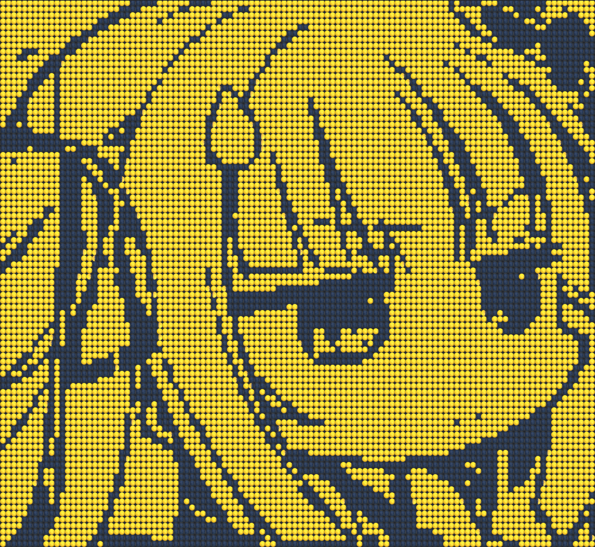

# Moonit
Convert any image into moon emoji art. 🌑 🌘 🌗 🌖 🌕 🌔 🌓 🌒


## Usage
Requirement: [xmake](https://xmake.io/#/).

Compilation:
```
git clone https://github.com/rikkaka/moonit
cd moonit
xmake -f m release
xmake
```
The executable file will be compiled under `./build/`.

Usage:
```
moonit <path to image> <rows of output> <columns of output>
```

## Effects

⬇️


---

⬇️


---

⬇️
